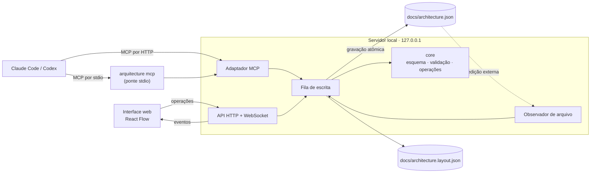
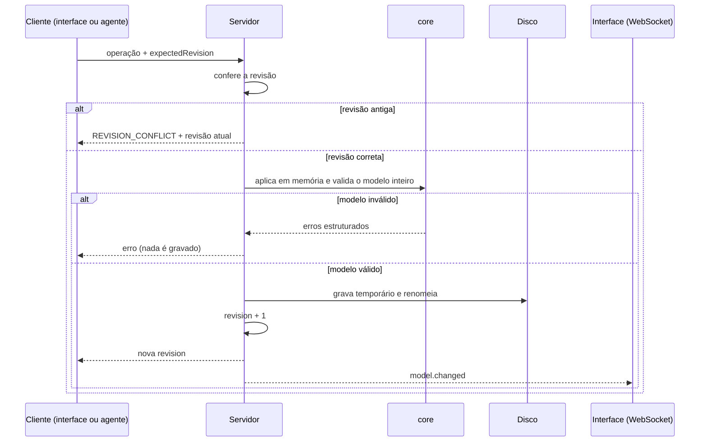

# Arquitetura — AI Architecture Studio

Este documento descreve como a ferramenta é construída. Para o que ela deve fazer, veja o [PRD](PRD.md); para a ordem de entrega, o [Roadmap](ROADMAP.md).

## Visão geral

Um único processo Node local é o dono dos arquivos de modelo. A interface web e os agentes nunca gravam no disco por conta própria: enviam operações ao servidor, que as aplica em fila.



## Decisões principais

| Decisão | Motivo |
| --- | --- |
| Ferramenta local iniciada com `npx` | Sem autenticação, backend hospedado ou custo de LLM |
| `docs/architecture.json` como fonte da verdade | Versionado com o código; interface e agente não divergem |
| Um único processo escritor | Resolve concorrência com uma fila, sem trava de arquivo |
| Integração por MCP | Um protocolo cobre Claude Code e Codex |
| Lista plana de nós com `parent` | Mover um nó de nível é barato e o diff do Git fica legível |
| Layout em arquivo separado | Mover uma caixa não polui o diff semântico |
| Lentes como registro interno | Separação entre visões sem manter uma API pública de plugins |
| TypeScript em todo o monorepo | O `core` é compartilhado entre servidor e interface |

## Pacotes

```
packages/
  core/     esquema, validação e operações puras; sem I/O
  server/   servidor local, fila de escrita, WebSocket, adaptador MCP, observador
  web/      interface React + React Flow
  cli/      comando arquitecture
```

O `core` não depende de nenhum outro pacote. Servidor e interface dependem dele; a CLI depende do servidor.

## Componentes

| Componente | Papel | Fala com |
| --- | --- | --- |
| Núcleo (`core`) | Esquema, validação, operações puras sobre o modelo | Usado por todos |
| Servidor local | Carrega o arquivo, aplica operações em fila, grava de forma atômica, publica eventos | Disco, interface, MCP |
| Adaptador MCP | Expõe as operações do núcleo como ferramentas | Claude Code, Codex |
| Interface web | Canvas; envia operações, recebe eventos | Servidor (HTTP e WebSocket) |
| Observador de arquivo | Detecta edição externa do JSON | Servidor |
| Ponte stdio | Repassa chamadas MCP por stdio ao servidor em execução | Agente, servidor |

## Fluxo de uma escrita



## Modelo

```json
{
  "schemaVersion": 1,
  "revision": 42,
  "meta": { "name": "HotelHub", "description": "Reservas de hotel" },
  "nodes": [
    { "id": "n_internet", "name": "Internet", "kind": "external", "parent": null },
    { "id": "n_nginx", "name": "Nginx", "kind": "proxy", "tech": "nginx", "parent": null },
    { "id": "n_docker", "name": "Docker", "kind": "group", "tech": "docker", "parent": null },
    { "id": "n_api", "name": "API", "kind": "service", "tech": "spring", "parent": "n_docker",
      "lenses": { "security": { "authn": "jwt", "authz": "rbac" } } },
    { "id": "n_db", "name": "PostgreSQL", "kind": "database", "tech": "postgresql", "parent": "n_docker",
      "lenses": { "data": { "tables": [] } } }
  ],
  "edges": [
    { "id": "e_1", "source": "n_internet", "target": "n_nginx", "label": "HTTPS", "kind": "sync" },
    { "id": "e_2", "source": "n_nginx", "target": "n_api", "label": "proxy_pass", "kind": "sync" }
  ]
}
```

| Campo | Regra |
| --- | --- |
| `schemaVersion` | Inteiro. Muda só em quebra de formato; cada mudança vem com uma migração |
| `revision` | Inteiro incrementado pelo servidor a cada escrita aceita no modelo. Gravar o layout não incrementa a `revision` |
| `nodes[].id` | Gerado pelo servidor, opaco e imutável |
| `nodes[].kind` | `external`, `proxy`, `group`, `service`, `frontend`, `database`, `cache`, `queue`, `storage` |
| `nodes[].tech` | Chave do catálogo de ícones; chave desconhecida cai no ícone do `kind` |
| `nodes[].parent` | `id` de outro nó ou `null` para a raiz |
| `nodes[].lenses` | Objeto por lente; lente desconhecida é preservada sem validação |
| `edges[].kind` | `sync`, `async` ou `data` |

As posições dos nós ficam em `docs/architecture.layout.json`, indexadas por `id`.

**Conexão entre níveis.** Uma conexão pode ligar nós de pais diferentes. No nível em que o destino está recolhido, o canvas a desenha chegando no ancestral visível.

## Layout

As posições ficam em `docs/architecture.layout.json`, fora do modelo, para que mover uma caixa não polua o diff semântico (DA-03).

- Gravado pelo servidor, pela mesma fila de escrita do modelo, com gravação atômica (arquivo temporário e renomeação).
- Gravar o layout não incrementa a `revision` do modelo e nunca gera `REVISION_CONFLICT`.
- Gravar o layout não publica nenhum evento: `model.changed` é publicado somente em escrita aceita no modelo. Cada aba da interface lê o layout ao carregar; sincronizar posições entre abas abertas ao mesmo tempo está fora do MVP.
- Uma gravação de layout malformada é recusada com `SCHEMA_INVALID`, com `path` apontando para o elemento dentro do arquivo de layout e `message` e `hint` como nos demais erros. Nada é gravado.
- Não há controle de conflito para o layout: vale a última escrita.
- Esquema próprio e mínimo: `schemaVersion` e `positions`, um objeto `{ x, y }` por `id` de nó.
- Posição de um `id` que não existe mais no modelo é ignorada ao carregar e removida na próxima gravação do layout. Remover um nó não exige gravar o layout na mesma operação.
- A interface grava a posição ao soltar o nó, não durante o arrasto.
- Arquivo ausente ou inválido não bloqueia nada: é tratado como "sem posições" e não coloca o modelo em estado inválido.
- O arquivo de layout é lido somente na inicialização do servidor. O observador de arquivo acompanha apenas o modelo.
- Uma edição externa do layout com o servidor em execução não é detectada e é sobrescrita na próxima gravação, porque vale a última escrita. Para aplicar um layout vindo de fora (por exemplo, após `git checkout`), reinicie a ferramenta.
- Nós sem posição recebem layout automático. Enquanto o layout por ELK não existir (da fase 2), usa-se um posicionamento simples em grade.

```json
{
  "schemaVersion": 1,
  "positions": {
    "n_nginx": { "x": 120, "y": 80 },
    "n_docker": { "x": 420, "y": 80 }
  }
}
```

## Validação

Duas camadas: forma (JSON Schema) e integridade (regras entre elementos). O modelo resultante é validado por inteiro antes de qualquer gravação.

| Código | Regra |
| --- | --- |
| `SCHEMA_INVALID` | O documento não obedece ao JSON Schema da `schemaVersion`. Também cobre o arquivo de layout: gravação de layout malformada é recusada com este código e `path` dentro do arquivo de layout |
| `DUPLICATE_ID` | Dois nós ou duas conexões com o mesmo `id` |
| `PARENT_NOT_FOUND` | `parent` aponta para nó inexistente |
| `PARENT_CYCLE` | Um nó é ancestral de si mesmo |
| `EDGE_ENDPOINT_NOT_FOUND` | `source` ou `target` inexistente |
| `EDGE_SELF_LOOP` | `source` igual a `target` |
| `EDGE_TO_ANCESTOR` | Conexão entre um nó e o próprio ancestral |
| `LENS_INVALID` | O trecho de uma lente conhecida não obedece ao esquema dela |
| `REVISION_CONFLICT` | A operação foi feita sobre uma revisão antiga |

Todo erro traz `code`, `message`, `path` (ponteiro JSON) e `hint`.

## Edição externa do arquivo

Não é possível impedir que um agente edite o JSON com as próprias ferramentas de arquivo. O observador valida toda mudança externa:

- **Válida:** o servidor adota o novo conteúdo e incrementa a revisão.
- **Inválida:** o servidor mantém em memória o último modelo válido, publica `model.invalid`, o canvas mostra os erros e novas escritas são recusadas até o arquivo ser corrigido ou restaurado.

## Integração MCP

O adaptador roda dentro do servidor e é exposto por HTTP em `127.0.0.1`. Para agentes que só aceitam stdio, `arquitecture mcp` é uma ponte que repassa as chamadas ao servidor em execução, mantendo um único escritor.

| Ferramenta | Efeito |
| --- | --- |
| `get_model` | Devolve o modelo ou uma subárvore (`scope`, `depth`) |
| `list_nodes` | Lista resumida, com filtros `parent` e `kind` |
| `add_node`, `update_node`, `move_node`, `remove_node` | Edição de nós |
| `add_edge`, `update_edge`, `remove_edge` | Edição de conexões |
| `set_lens` | Substitui o trecho de uma lente em um nó |
| `apply_batch` | Várias operações, tudo ou nada, uma revisão e um evento |
| `validate` | Erros do modelo atual |

**Concorrência.** Toda escrita aceita `expectedRevision`. Sem ela, a operação é aplicada sobre o estado atual. Com valor diferente do atual, a resposta é `REVISION_CONFLICT`.

**Eventos.** `model.changed`, `model.invalid` e `model.restored`, publicados por WebSocket. `model.changed` é publicado somente em escrita aceita no modelo; gravar o layout não publica evento.

## Interface

- Painel lateral à esquerda (árvore de nós e propriedades), canvas à direita, abas no topo.
- Cada nível da hierarquia é uma tela com os filhos diretos do nó atual.
- Duplo clique entra em um nó; a trilha volta; o nível fica na URL (`#/n_docker/n_api`).
- Posição manual é persistida. Na fase 1, nós sem posição recebem posicionamento simples em grade; a partir da fase 2, recebem layout automático por ELK.
- Ícones do Devicon embutidos no pacote, sem requisição externa.
- Desfazer é local à sessão da interface e não desfaz alterações do agente.

## Lentes

Uma lente é um módulo interno registrado no código.

```ts
interface Lens {
  name: string;                       // "data", "security"
  appliesTo: NodeKind[];              // em quais kinds a lente aparece
  schema: JSONSchema;                 // valida node.lenses[name]
  View: Component<{ node, model }>;   // aba ou sobreposição no canvas
  importers?: Importer[];             // geram o trecho a partir de arquivos do repo
}
```

| Lente | Aplica-se a | Visão | Preenchimento |
| --- | --- | --- | --- |
| `data` | `database` | Diagrama ER ao entrar no nó | Manual, importadores (Prisma primeiro) ou agente |
| `security` | `service`, `proxy`, `frontend`, `group` | Sobreposição no canvas | Agente ou manual |

## Pontos ainda não definidos

Estes pontos afetam a implementação e estão registrados como decisões em aberto no PRD:

- Como a ponte stdio descobre o servidor e o que faz se ele não estiver em execução.
- Proteção do endpoint HTTP local além de escutar só em `127.0.0.1`.
- Política de migração entre valores de `schemaVersion`.